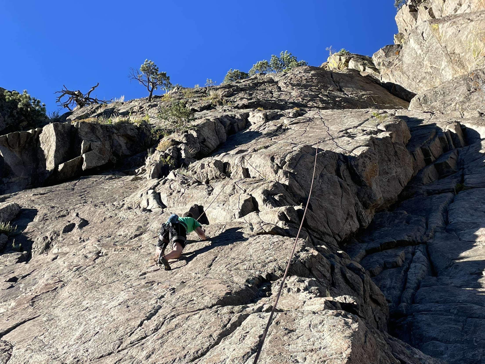
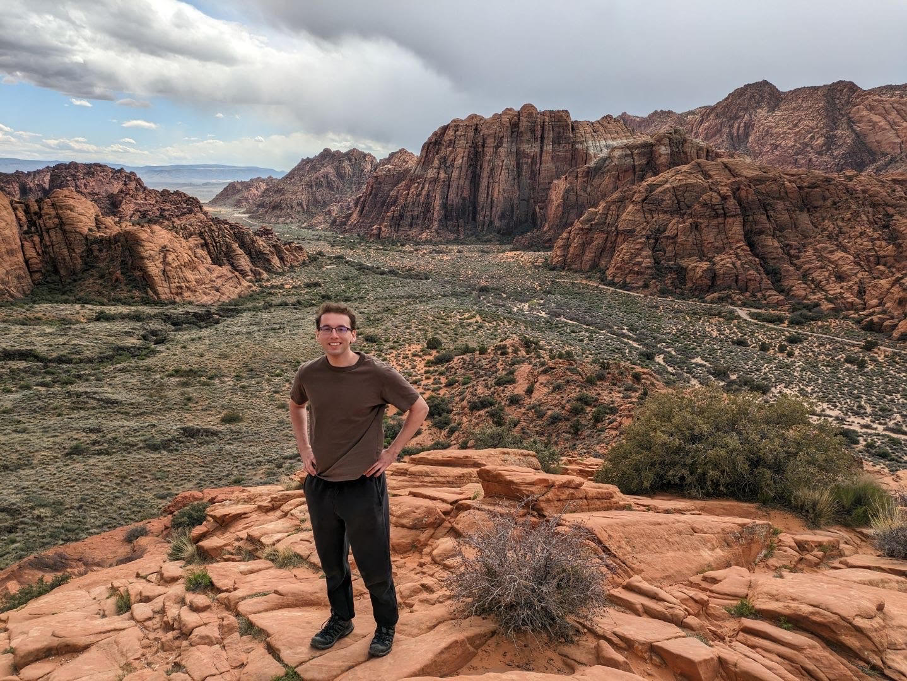
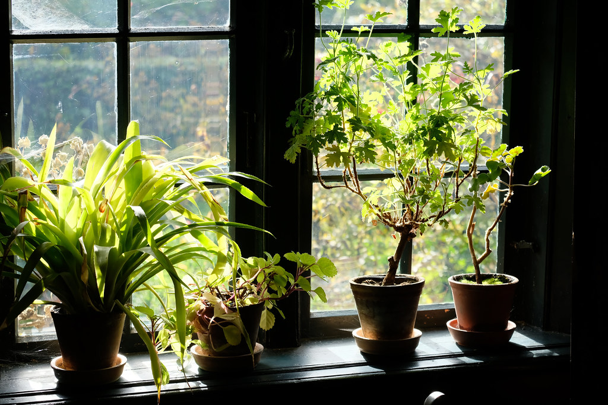

{: .align-left}
One of my hobbies I am most interested in at the moment is rock climbing. I climb outisde and inside and I currently try all kinds of climbing including lead climbing, top roping, and bouldering. The picture above is when I went climbing with some friends in Boulder Canyon

{: .align-right}
In a similar vein to rock climbing I also really enjoyig hiking. This picture is from Snow Canyon in Utah and was one of my favorite hikes I have done. In addition, I have also done several 14ers and other hikes around Boulder and Colorado. 

{: .align-right}
I also like growing different kinds of plants. I have several houseplants, succulents, and terrariums that I use to grow different species. 