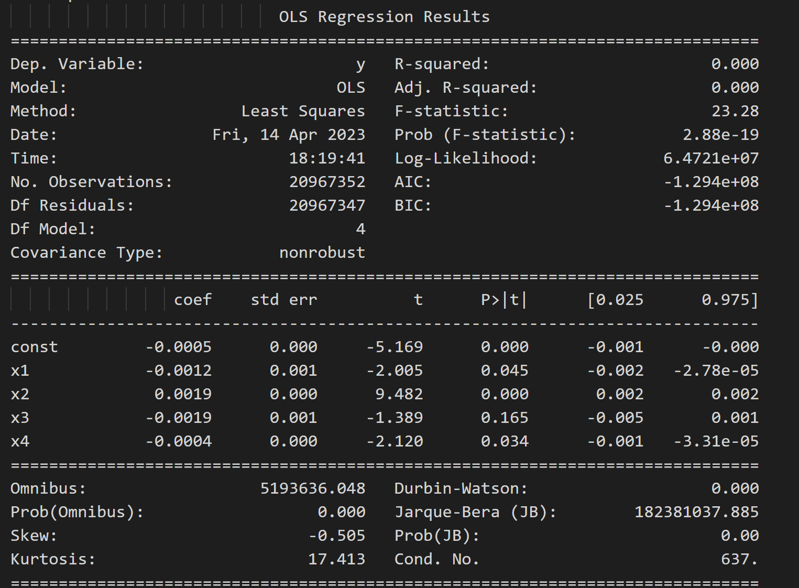
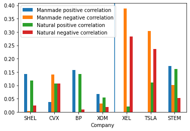

**Finance TV**

The goal of this project was to see if we could find a relationship between finance TV shows and the stocks they talk about. If they 
talk about a stock positively, do we see an increase in that stock price? 

For the technical aspects of this project me and a team of 6 people Scraped TV channel(CNN, Bloomberg, FOXNEWS, etc) metadata, videos, and captions using Beautiful Soup and the archive.org API. We cleaned the data by removing mentions of commercials and other sources of noise and used spaCy to find mentions of entities/companies. We then merged stock data with the relevant finance TV show caption data to have one dataset with a single time index. We generated a feature by running tone analysis on the captions. We then used OLS regression to try and find a relationship between the tone analysis and the stock price. However, our OLS regression yielded an R^2 of 0 which indicates no relationship between the 
variables. Future work includes trying other models/analysis. 

{: .align-right}

**Effects of natural disasters**

In this project I worked in a team of three to see how disasters impact the energy and renewable energy sectors and how they affect the stock prices both negatively and positively. 

We looked at eight main companies spread across the renewable energy and fossil fuel energy sectors: Shell, BP Oil, Chevron Corporation,Exxon Mobil Corp, Tesla, Xcel Energy Inc, Iberdrola SA, and JinkoSolar Holding Co., Ltd 
 
If the impact of the disasters on company stock price are known, companies in the energy and renewable energy sectors can better predict the impact these events will have on their stock price. 

We combined GDELT event data (Global Database of Events, Language and Tone) with YFinance stock data and then ran different models on top (OLS Regression, KNN, Random Forest)

{:width="100%"}

**Object Oriented Casino**

In this project I worked with a partner to make a simulation of a casino with a focus on object oriented principles. We made a successfull casino simulation with logging, npcs who
bet timidly or agressively as well as casino, player, card deck, and other varied classes that implemented patterns like singleton, observer, factory, and strategy. 

